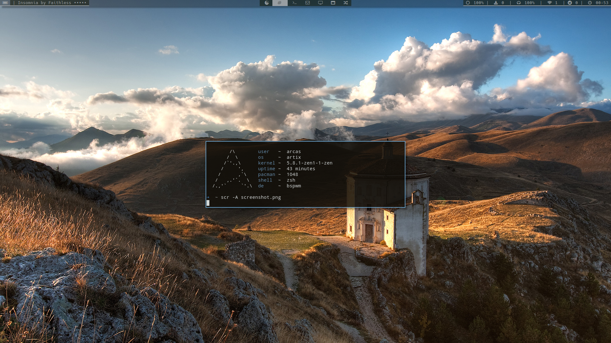
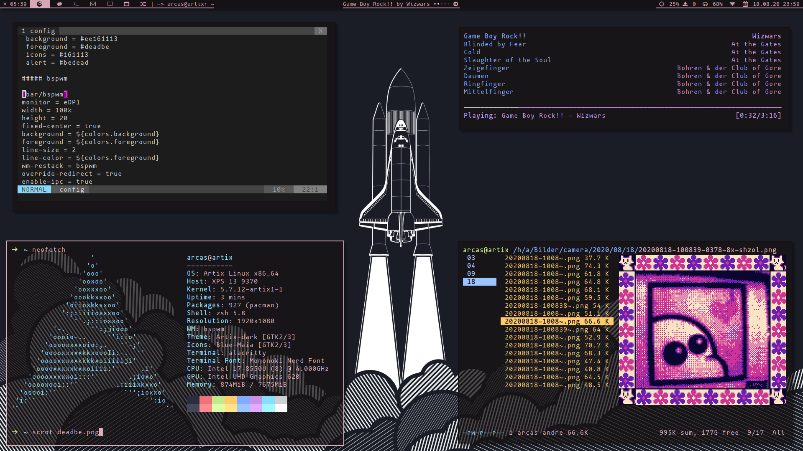

# .config

**Screenshot**

* bspwm
some autostart stuff and window rules

* kitty
Kitty terminal settings

* mpd & ncmcpp
Color and layout config; mpd server settings

* picom
compositor

* polybar
Color and module config

* ranger
Enable kitty backend; ffmpeg based preview images for movies

* sxhkd
Shortcuts

* tuir
Terminal UI Reddit Settings 

## Dependencies
* bspwm
* sxkhd
* polybar
* picom
* kitty
* [Fork Awesome](https://forkaweso.me/Fork-Awesome/)
* Hack Nerd Font
* pywal
* tuir
* dmenu
* ranger
* ncmpcpp & mpd

*Note:* Potentially migrading to modpidy

Old screenshots:

